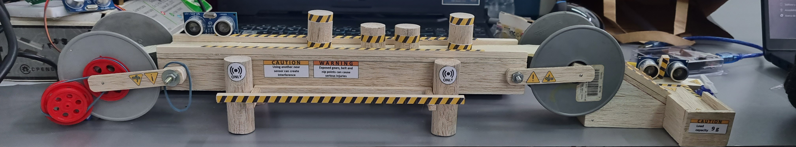
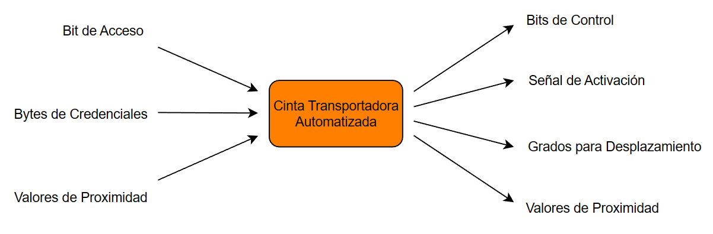
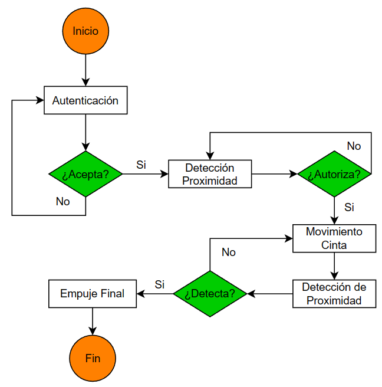
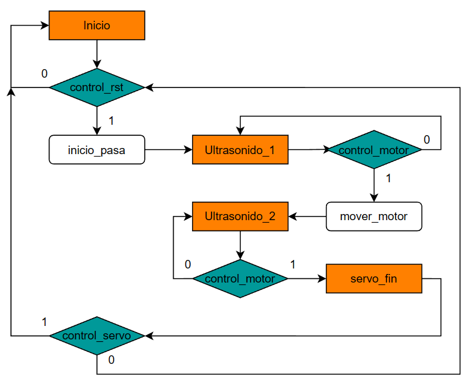

# Cinta Transportadora Automatizada
***Universidad Nacional de Colombia***

_Proyecto Final - Electrónica Digital 1 - 2023-1S_

## _Integrantes del Proyecto_

- Nicolás Osorio Guarín.
- Sergio Andrés Gordillo Gómez.
- Andrea Catherin Carreño Sierra.

## _¿En qué consiste?_

Implementar un sistema automatizado de gestión de equipos donde el estudiante pueda acceder desde un banco de laboratorio con una interfaz para solicitar los equipos necesarios para el desarrollo de la practica. De manera que, el personal del almacén genere una revisión y aprobación de la solicitud para realizar la entrega.

:bulb: Este proyecto se realizó con base en protocolos en VDHL utilizando una FPGA como tarjeta de desarollo junto con Arduino para complementar la alimentación, además de los periféricos de salida y entrada implementados como mediadores de dichos protocolos, tales como:

- Lector de tarjetas RFID-RC522
- Sensor ultrasonido HY-SRF05
- Motor paso a paso 28BYJ-48
- Servomotor SG90

## _Alcance y Problemática_

### Alcance del proyecto

El objetivo de este proyecto es implementar una solución tecnológica que permita la actualización de la infraestructura de los espacios de los laboratorios de ingeniería ubicados en el Edificio 411. La finalidad es mejorar las condiciones y capacidades de los laboratorios para facilitar el desarrollo de actividades académicas y prácticas relacionadas con la ingeniería.

El alcance del proyecto abarcará principalmente:

- Evaluación de la infraestructura existente: Se realizará una evaluación exhaustiva de los laboratorios de ingeniería en el Edificio 411 para identificar las áreas de mejora y determinar los requisitos tecnológicos necesarios.

- Diseño de la solución tecnológica: Con base en los resultados de la evaluación, se elaborará un diseño detallado de la solución tecnológica que incluirá la actualización de equipos, sistemas y software necesarios para mejorar la funcionalidad y eficiencia de los laboratorios.

### Problemática a resolver

En los laboratorios de Ingeniería (Ed. 411), día a día se presenta un desafío significativo relacionado con la gestión de equipos para el desarrollo de las clases o una práctica libre. A menudo, se pierde tiempo valioso en la entrega de equipos debido a las limitantes con respecto al espacio de almacenamiento para la gestión de los equipos en relación con la cantidad de estudiantes que utilizan el laboratorio simultáneamente.

Esta situación tiene un impacto negativo en la eficiencia y efectividad tanto de los laboratorios como de los mismos estudiantes durante su permanencia en este espacio. Además, se puede evidenciar un incorrecto manejo del tiempo debido a todo el proceso que implica gestionar los equipos para el desarrollo de algún laboratorio. De manera que, no se reduce únicamente a pedir el préstamo de equipos de laboratorio, también implica un costo ambiental al utilizar los formatos de préstamo de equipos haciendo inviable el consumo que se ha mantenido durante los años del laboratorio.

Cabe destacar que esto implica que se afecte la calidad de los equipos por el exceso de la manipulación y la precisión de los resultados a largo plazo al transportar los equipos de un sitio a otro, donde en algunos casos puede ocurrir que se genere un impacto físico a los equipos reduciendo su vida útil. Por lo tanto, los resultados pueden diferir y tener una incertidumbre aún mayor que la que se esperaría obtener por los estudiantes, de manera que puede afectar el proceso de aprendizaje sobre la materia para la cual se solicita la práctica.

## _Diagrama de Caja Negra_
El diagrama de caja negra se describe a partir de las entradas y salidas del sistema, se interpreta de la siguiente forma:

## _Diagrama de Flujo_
En este caso, se describen los procesos internos de funcionamiento del dispositivo y en cada uno de los módulos, visualizánodose de la siguiente manera:

## _Máquina de Estados_
Para etender mejor el comportamiento de la secuencia de este proyecto, se realiza una máquina de estados algorítmica describiendo como estados a las funciones de los periféricos.

## _Simulaciones_

Descripción de las simulaciones realizadas y sus resultados.

## _Evidencia de ImplementaciónM_
La implementación del proyecto se llevó a cabo por etapas, es decir, por módulos, cada módulo representando el funcionamiento de cada periférico que al final están instanciados en el código principal, entonces, el funcionamiento que refiere para cada uno es:

1. Lector de tarjetas RFID-RC522

   
3. Sensor Ultrasonido HY-SFR05

  
5. Motor paso a paso 28BYJ-48

7. Servomotor SG90

## _Video del Proyecto_

[Enlace al Video del Proyecto](enlace-video-proyecto)

## _Referencias_

-  Referencia 1
-  Referencia 2
-  Referencia 3

